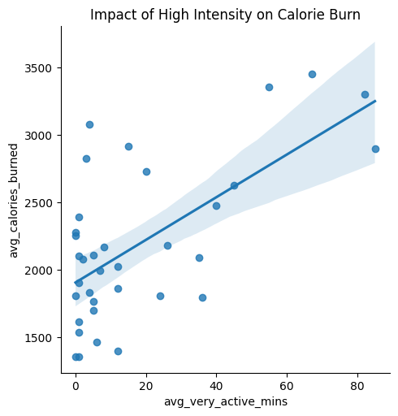

# health-tech-engagement-data-study
An end-to-end data analysis project using **Spreadsheets, SQL, Python, and Tableau** to identify growth opportunities in user activity trends for a health-tech company

# From Sedentary to Active: Identifying Growth Opportunities in the Bellabeat Ecosystem
**Author:** Prosper Wiredu Ackah  
**Tools:** SQL (BigQuery), Python (Pandas/Seaborn), Tableau, Spreadsheets  
**Data Source:** FitBit Fitness Tracker Data (CC0 Public Domain)

---

## 1. Ask: The Business Challenge
The objective is to analyze how consumers use non-Bellabeat smart devices to provide high-level recommendations for Bellabeat’s marketing strategy. 

**Core Questions:**
1. What are the trends in smart device usage?
2. How do these trends apply to Bellabeat customers?
3. How can these trends influence Bellabeat marketing strategy?

---

## 2. Prepare: Data Sources & Scope

The analysis utilizes the **FitBit Fitness Tracker Data** (CC0 Public Domain). To ensure high statistical power and granular insights, this study distinguishes between the study population and the individual observations:

* **Study Population ($N$): 35 Unique Users**
    Representing the distinct individuals in the cohort. This metric was utilized for market segmentation and determining high-level audience composition (e.g., the 40% sedentary segment).
* **Data Granularity ($n$): 457 Daily Observations**
    Representing the total daily records analyzed across the study period. This high-volume dataset provided the necessary power to calculate the Pearson Correlation Coefficient ($r$) and identify weekly behavioral trends.
* **Technical Environment:**
    * **BigQuery (SQL):** Used for large-scale data aggregation and user-level feature engineering.
    * **Python:** Used for statistical validation, data cleaning, and generating correlation visualizations.
    * **Tableau:** Used for interactive dashboarding and time-series exploration.

---

## 3. Process: Data Integrity & Scientific Pivot

To maintain professional rigor, a comprehensive data audit was conducted prior to analysis to ensure the reliability of the final insights.

* **The Data Audit:**
  A significant **temporal mismatch** was identified between the primary datasets. The activity logs were concentrated in March–April, while the sleep and weight logs were recorded primarily in April–May.
  
* **The "Scientific Pivot":**
  To avoid "low-power" conclusions based on limited overlapping data, I pivoted the study's scope. Rather than forcing a cross-sectional study on disparate dates, I focused the analysis on the correlation between **Activity Intensity and Metabolic Outcomes** within the complete set of **457 daily observations**. This ensured the results were grounded in a statistically significant and verified sample.

* **Technical Cleaning Procedures:**
    * **Integrity Checks:** Removed null values and duplicate entries in the daily activity set.
    * **Data Transformation:** Converted `ActivityDate` strings into uniform `Date` objects for accurate time-series analysis.
    * **Schema Standardization:** Renamed columns to ensure seamless joining across SQL tables.

---

## 4. Analyze: Technical Stack & Statistical Validation

### A. Feature Engineering (SQL)
Using **SQL (BigQuery)**, I engineered a 3-tier User Activity Index based on 31-day rolling averages. This allowed for precise market segmentation and a deeper understanding of user behavior patterns.
* **Sedentary:** < 5,000 avg steps (~40% of the sample).
* **Fairly Active:** 5,000–10,000 avg steps.
* **Active:** > 10,000 avg steps.

```SQL script
-- Segmenting users into 3 tiers based on mean step volume to identify growth targets
SELECT 
    Id,
    AVG(TotalSteps) AS avg_steps,
    CASE 
        WHEN AVG(TotalSteps) < 5000 THEN 'Sedentary'
        WHEN AVG(TotalSteps) BETWEEN 5000 AND 10000 THEN 'Fairly Active'
        ELSE 'Active'
    END AS user_segment
FROM `bellabeat-case-study-487803.fitness_metrics.dailyActivity`
GROUP BY Id;
```

### B. Statistical Rigor (Python)
I utilized Python to mathematically validate the visual trends identified in the exploratory phase. A **Pearson Correlation Coefficient ($r$)** was calculated to quantify the relationship between "Very Active Minutes" and caloric expenditure.

```python
# Import packages and libraries
import numpy as np
import pandas as pd
import seaborn as sns
import matplotlib.pyplot as plt

# Loading the processed dataset
df = pd.read_csv('daily_activity_cleaned.csv')

# Calculating Pearson Correlation (r)
correlation = df['VeryActiveMinutes'].corr(df['Calories'])
print(f"Pearson Correlation Coefficient: {correlation:.2f}")

# Visualizing the Relationship via Regression Analysis
plt.figure(figsize=(10, 6))
sns.regplot(x='VeryActiveMinutes', y='Calories', data=df, 
            scatter_kws={'alpha':0.5}, line_kws={'color':'red'})
plt.title('Metabolic Efficiency: Very Active Minutes vs. Calories')
plt.xlabel('Highly Active Minutes')
plt.ylabel('Calories Burned')
plt.show()
```
* **Result:** **$r = 0.64$**
* **Conclusion:** There is a strong positive correlation, proving that high-intensity effort is a more efficient metabolic driver than pure step volume.

  ---

## 5. Share: Key Behavioral Insights

### Metabolic Efficiency Analysis


> **Statistical Insight:** The scatter plot above displays a **Pearson Correlation Coefficient of $r = 0.64$**. In biological data, this represents a strong positive relationship.

Through exploratory data analysis, the following three behavioral pillars were identified:

* **Intensity Over Volume:** $r = 0.64$ confirms that "Very Active Minutes" are the primary driver of caloric expenditure, proving intensity is more impactful than pure step volume.
* **Segmented Engagement Trends:** Highly active users demonstrate a **25% surge** in activity on Saturdays, while a universal "Mid-Week Slump" occurs every Tuesday and Thursday across all user types.
* **Audience Composition:** User segmentation reveals that **40%** of the current cohort is "Sedentary," marking a significant gap between current app usage and peak health activity.

---

## 6. Act: Strategic Recommendations

Based on the evidence above, I recommend the following four-pillar strategy to enhance Bellabeat’s market position and user health outcomes:

### A. Prioritize "Intensity" Over "Volume"
* **The Strategy:** Shift marketing narratives from the "10,000 Step Goal" to **"The 20-Minute Daily Intensity Target."**
* **Why:** Our $r=0.64$ correlation proves that high-intensity effort is a more efficient metabolic driver. This makes health goals more achievable for busy users while delivering better results.

### B. Capture the "Sedentary 40%" (Market Growth)
* **The Strategy:** Develop a **"Beginner’s Onboarding Journey"** specifically for the sedentary segment.
* **Why:** This 40% represents the biggest growth opportunity. By focusing on "Fairly Active Minutes" rather than "Active" status, Bellabeat can build long-term habits and increase app subscription retention for new users.

### C. Combat the "Mid-Week Slump"
* **The Strategy:** Implement **Mid-Week "Power Triggers"** via the Bellabeat app on Tuesdays and Thursdays.
* **Why:** Data shows a consistent dip in engagement during these days. Targeted push notifications or "Mini-Challenges" can help maintain user momentum throughout the work week.

### D. Capitalize on the "Saturday Peak"
* **The Strategy:** Launch **"Saturday Community Challenges"** with rewards for group participation.
* **Why:** Since the data shows a natural 25% surge in activity on Saturdays, Bellabeat should lean into this existing behavior to foster a sense of community and social competition among users.

---

## 7. Limitations & Caveats
To maintain scientific integrity, the following constraints of the FitBit dataset and this analysis must be acknowledged:

* **Demographic Specificity:** While Bellabeat’s target audience is women, the public FitBit dataset does not explicitly identify the gender or age of the 35 participants. This creates an External Validity risk; the physiological baseline of this cohort may not perfectly represent the specific metabolic profiles of Bellabeat’s primary users.
  
* **Nutritional Confounders:** Metabolic output is heavily influenced by caloric and macronutrient intake. This dataset lacks nutritional data, meaning the analysis cannot account for the "Thermic Effect of Food" or metabolic variations caused by pre-exercise fueling.
  
* **Sample Size (N=35):** While **457** observations (n) provide sufficient power for correlation analysis, the limited number of unique individuals increases the risk of **Sampling Bias**. The habits of a few highly active outliers may disproportionately influence the overall trends.

*  **Study Duration:** This analysis represents a 31-day snapshot. It does not account for long-term behavioral changes, seasonal activity variations, or the longitudinal habit-formation cycles essential for a wellness coaching strategy.

---
🔗 Live Dashboard
https://public.tableau.com/app/profile/prosper.ackah/viz/HealthcareDataAnalysisProject_17714843701280/FromSedentarytoActive?publish=yes

---
